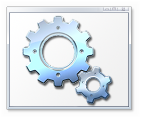

# Hello I'm Dexter,
I am an accomplished photographer and programmer. Proficient in **Python**, **C++** and **Java**, with additional expertise in **HTML** and **CSS**. Starting my programming journey in 2021, I initially engaged with languages like **Batch** to learn the fundamentals before advancing to **Python**. This progression led me to expand onto **C++** & **Java** by 2023
<h3 alight="left">Languages I Know:</h3>

